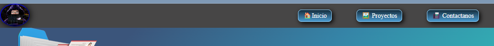
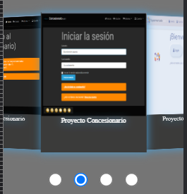
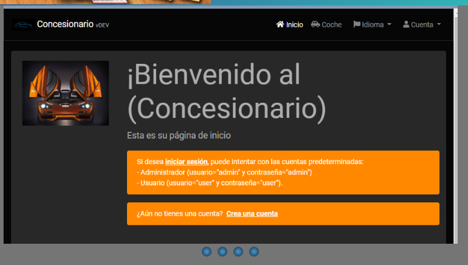
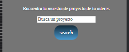
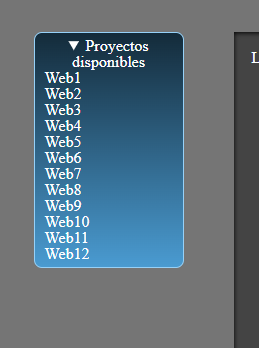
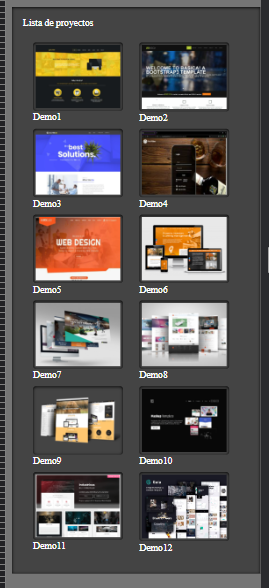
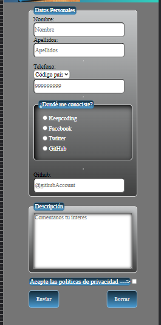
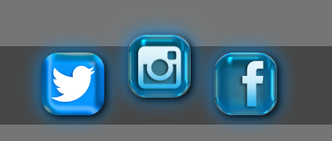

# PRACTICA - HTML - CSS

**`Angel MAgallanes`**

     
 

Bienvenido a mi presentación de HTML-CSS mediante el cual se presenta un maquetado sencillo de HTML con una semantica adecuada para sección de cada página, y un poco de lo mejor de diseño que podria lograrse en una pagina solo con CSS. 

 

*Captura de pagina principal.*
#
#
# CONTENIDO

- [Secciones](#.)
  - [Navbar](#Navbar)
    - `En cada pagina encontrara en la parte superior una barra de navegación`
  - [Home](#Home)
    - `Sección 1`
      - `Un carousel en dos resoluciones para adaptarlo a mobiles`      
    - `Sección 2`
      - `Barras de progreso animadas con CSS`
  - [Proyectos](#Proyectos)
    - `Sección 1`
      - `Barra de busqueda de proyectos (sin función)`
    - `Sección 2`
      - `una lista lateral resumida de proyectos`
    - `Sección 3`
      - `Muestra gráfica de los proyectos realizados (orientativo a diseño, no son reales)`
  - [Contacto](#Contacto)
    - `Sección 1`
      - `Formulario de contacto para los visitantes (sin función)`      
  - [Footer](#Footer)
    - `todas las paginas tienen en la parte inferior un footer con acceso a nuestras redes sociales`
      
#
# Muestras de contenido

### Navbar

- En esta barra encontraras los botones de acceso a las distintas secciónes de la pagina

  

### Home

- **Sección 1**
  - En `primer lugar` visualizaremos el `carousel` en versión mobile.

    
- **Sección 2**
  - Y para la resolución `desktop` el `carousel` se veria de esta manera.

    
- **Sección 3** 
  - En la parte inferior estara dispueto un grupo de `barras de estado` que se animaran al momento de acceso a la pagina mostrando cuales son las habilidades en constante evolución del desarrollador

  

### Proyectos
- **Sección 1**
  - Al acceder a nuestra `página de proyectos` encontrara una `barra de busqueda` para filtrar proyectos que puedan orientarse a lo que usted esta buscando esta barra la tendra tanto en mobil como en desktop.

    
- **Sección 2**
  - A un lado y **`SOLO en la versión desktop`**, podra encontrar una `lista desplegable` con los proyectos presentados.

    
- **Sección 3**
  - En la parte central un cuadro contenedor con miniaturas de los diseños de nuestros proyectos en los que podra ademas de orientar la temática, apreciar el diseño que se adapte a su gusto.

    

### Contacto
- **Sección 1**
  - En esta pagina si ha encontrado algo de su agrado podra ponerse en contacto con el departamento de marketing a través de nuestro formulario.

  

### Footer
- **Sección 1**
  - Al final de cada una de nuestras paginas podra encontrar un footer mediante el cual tendra acceso a nuestras redes sociales para seguir todos nuestros trabajos.

  

#

        
#
- Angel Magallanes :

  

#
----------------------- **`Práctica desarrollada para el modulo de HTML - CSS de Keepcoding.`**------------------
#